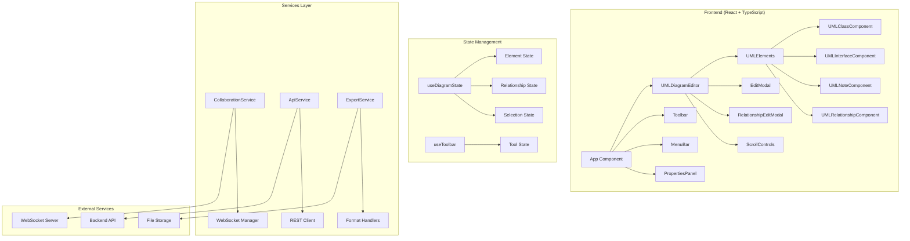
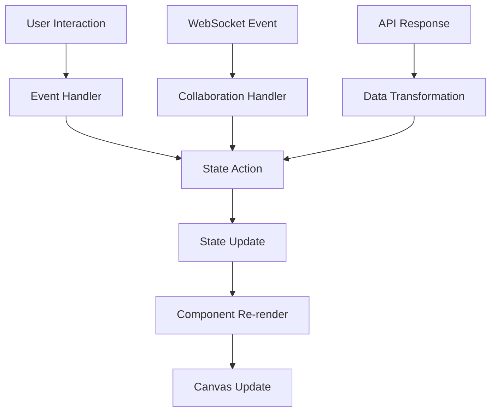
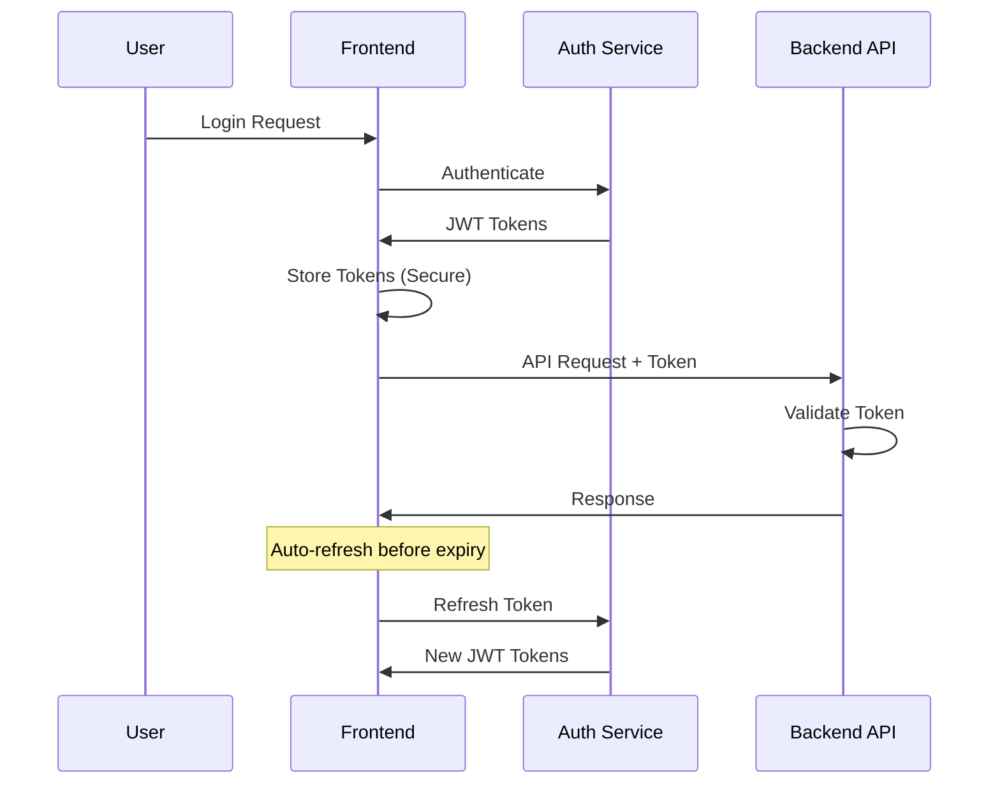

# 🏗️ Architecture Documentation

## 📐 Visión General de la Arquitectura

UML Class Diagram Designer implementa una arquitectura moderna basada en React con patrones de diseño robustos y preparación para escalabilidad.

## 🏛️ Arquitectura de Alto Nivel



## 🧩 Componentes Principales

### 1. UMLDiagramEditor (Core Component)

**Responsabilidades:**
- Renderizado del canvas Konva
- Manejo de eventos de mouse/touch
- Coordinación entre elementos
- Gestión de relaciones dinámicas

**Arquitectura interna:**
```typescript
interface EditorArchitecture {
  // Canvas Layer
  canvas: {
    stage: Konva.Stage;
    layer: Konva.Layer;
    transformer: Konva.Transformer;
  };
  
  // State Management
  state: {
    elements: UMLElement[];
    relationships: UMLRelationship[];
    selectedElements: string[];
    zoom: number;
    pan: { x: number; y: number };
  };
  
  // Event Handlers
  handlers: {
    onElementCreate: (element: UMLElement) => void;
    onElementUpdate: (element: UMLElement) => void;
    onRelationshipCreate: (relationship: UMLRelationship) => void;
    onSelectionChange: (selectedIds: string[]) => void;
  };
}
```

### 2. State Management Pattern

**useDiagramState Hook:**
```typescript
interface DiagramState {
  // Core Collections
  classes: UMLClass[];
  interfaces: UMLInterface[];
  notes: UMLNote[];
  relationships: UMLRelationship[];
  
  // UI State
  selectedElements: string[];
  zoom: number;
  pan: { x: number; y: number };
  
  // History for Undo/Redo
  history: DiagramState[];
  historyIndex: number;
}

// Actions
interface DiagramActions {
  // Element CRUD
  addClass: (classData: Partial<UMLClass>) => void;
  updateClass: (id: string, updates: Partial<UMLClass>) => void;
  deleteClass: (id: string) => void;
  
  // Relationship CRUD
  addRelationship: (relationshipData: Partial<UMLRelationship>) => void;
  updateRelationship: (id: string, updates: Partial<UMLRelationship>) => void;
  deleteRelationship: (id: string) => void;
  
  // Selection
  selectElements: (ids: string[]) => void;
  clearSelection: () => void;
  
  // History
  undo: () => void;
  redo: () => void;
  
  // View
  setZoom: (zoom: number) => void;
  setPan: (pan: { x: number; y: number }) => void;
}
```

### 3. UML Element Components

**Component Hierarchy:**
```
UMLElementBase (Abstract)
├── UMLClassComponent
│   ├── ClassHeader
│   ├── AttributesList  
│   └── MethodsList
├── UMLInterfaceComponent
│   ├── InterfaceHeader
│   └── MethodsList
├── UMLNoteComponent
│   └── NoteContent
└── UMLRelationshipComponent
    ├── ConnectionLine
    ├── ArrowHead
    └── Labels
```

**Shared Props Pattern:**
```typescript
interface UMLElementProps<T extends UMLElement> {
  element: T;
  isSelected: boolean;
  isEditing: boolean;
  onSelect: (id: string) => void;
  onUpdate: (id: string, updates: Partial<T>) => void;
  onDelete: (id: string) => void;
  onStartEditing: (id: string) => void;
  onStopEditing: () => void;
}
```

## 🔄 Data Flow Architecture

### 1. Unidirectional Data Flow



### 2. Event System

**DOM Events → Application Events:**
```typescript
// Canvas Events
interface CanvasEvents {
  'element:click': { elementId: string; position: Point };
  'element:drag': { elementId: string; newPosition: Point };
  'element:resize': { elementId: string; newSize: Size };
  'canvas:click': { position: Point };
  'relationship:start': { fromElement: string; position: Point };
  'relationship:end': { toElement: string; position: Point };
}

// Application Events
interface ApplicationEvents {
  'diagram:loaded': { diagramId: string };
  'element:created': { element: UMLElement };
  'element:updated': { elementId: string; changes: Partial<UMLElement> };
  'element:deleted': { elementId: string };
  'collaboration:user_joined': { userId: string; userName: string };
  'export:completed': { format: string; downloadUrl: string };
}
```

## 🎨 Rendering Architecture

### 1. Konva.js Integration

**Layer Structure:**
```typescript
interface CanvasLayers {
  // Background Layer (Grid, background)
  backgroundLayer: {
    grid?: Konva.Group;
    background?: Konva.Rect;
  };
  
  // Relationship Layer (Behind elements)
  relationshipLayer: {
    relationships: Konva.Group[];
    temporaryLines: Konva.Line[];
  };
  
  // Element Layer (UML Elements)
  elementLayer: {
    classes: Konva.Group[];
    interfaces: Konva.Group[];
    notes: Konva.Group[];
  };
  
  // UI Layer (Selection, controls)
  uiLayer: {
    transformer: Konva.Transformer;
    selectionBox: Konva.Rect;
    cursors: Konva.Circle[];
  };
}
```

### 2. Dynamic Relationship Rendering

**Algorithm for Dynamic Connections:**
```typescript
class RelationshipRenderer {
  // Calcula puntos de conexión optimales
  calculateConnectionPoints(
    fromElement: UMLElement, 
    toElement: UMLElement
  ): { start: Point; end: Point } {
    // 1. Obtener centros de elementos
    const fromCenter = this.getElementCenter(fromElement);
    const toCenter = this.getElementCenter(toElement);
    
    // 2. Calcular intersecciones con bordes
    const startPoint = this.getIntersectionPoint(fromElement, toCenter);
    const endPoint = this.getIntersectionPoint(toElement, fromCenter);
    
    return { start: startPoint, end: endPoint };
  }
  
  // Optimización: Solo recalcula relaciones afectadas
  updateRelationships(updatedElementId: string): void {
    const affectedRelationships = this.getRelationshipsForElement(updatedElementId);
    affectedRelationships.forEach(rel => this.updateRelationshipPath(rel));
  }
}
```

## 🔌 Plugin Architecture (Preparado)

### 1. Plugin System Design

```typescript
interface Plugin {
  id: string;
  name: string;
  version: string;
  
  // Lifecycle hooks
  onInstall?: () => void;
  onEnable?: (context: PluginContext) => void;
  onDisable?: () => void;
  
  // Feature extensions
  toolbar?: ToolbarExtension;
  elements?: ElementExtension[];
  exporters?: ExportExtension[];
  
  // Dependencies
  dependencies?: string[];
  conflicts?: string[];
}

interface PluginContext {
  registerTool: (tool: CustomTool) => void;
  registerElement: (element: CustomElementType) => void;
  registerExporter: (exporter: CustomExporter) => void;
  
  // Access to core services
  diagramService: DiagramService;
  collaborationService: CollaborationService;
  apiService: ApiService;
}
```

### 2. Extension Points

```typescript
// Herramientas personalizadas
interface CustomTool extends ToolDefinition {
  icon: React.ComponentType;
  cursor: string;
  onActivate: (context: ToolContext) => void;
  onDeactivate: () => void;
  onCanvasClick: (position: Point) => void;
}

// Elementos UML personalizados
interface CustomElementType {
  type: string;
  displayName: string;
  icon: React.ComponentType;
  
  // Factory
  create: (position: Point) => CustomElement;
  
  // Renderer
  component: React.ComponentType<UMLElementProps<CustomElement>>;
  
  // Serialization
  serialize: (element: CustomElement) => SerializedElement;
  deserialize: (data: SerializedElement) => CustomElement;
}
```

## 🚀 Performance Architecture

### 1. Rendering Optimizations

```typescript
// Virtualization for large diagrams
class ViewportManager {
  private visibleElements = new Set<string>();
  
  updateViewport(viewport: Rectangle): void {
    const newVisible = this.getElementsInViewport(viewport);
    
    // Only re-render changed elements
    const toAdd = newVisible.filter(id => !this.visibleElements.has(id));
    const toRemove = Array.from(this.visibleElements).filter(id => !newVisible.includes(id));
    
    toAdd.forEach(id => this.renderElement(id));
    toRemove.forEach(id => this.hideElement(id));
    
    this.visibleElements = new Set(newVisible);
  }
}

// Debounced updates
const debouncedUpdateRelationships = debounce((elementId: string) => {
  relationshipRenderer.updateRelationships(elementId);
}, 16); // ~60fps
```

### 2. Memory Management

```typescript
// Cleanup strategies
interface MemoryManager {
  // Canvas cleanup
  cleanupDeletedElements(): void;
  
  // Event listener cleanup
  removeOrphanedListeners(): void;
  
  // Image cache management
  clearImageCache(): void;
  
  // WebSocket connection pooling
  recycleConnection(): void;
}
```

## 🔒 Security Architecture

### 1. Input Validation

```typescript
// Schema validation for UML elements
const UMLClassSchema = z.object({
  id: z.string().uuid(),
  name: z.string().min(1).max(100),
  x: z.number().min(0).max(10000),
  y: z.number().min(0).max(10000),
  attributes: z.array(AttributeSchema).max(50),
  methods: z.array(MethodSchema).max(50)
});

// Sanitización de entrada
function sanitizeUserInput(input: string): string {
  return DOMPurify.sanitize(input, {
    ALLOWED_TAGS: [],
    ALLOWED_ATTR: []
  });
}
```

### 2. Authentication Flow



## 🧪 Testing Architecture

### 1. Testing Strategy

```typescript
// Component Testing
describe('UMLClassComponent', () => {
  test('renders class with attributes', () => {
    render(<UMLClassComponent element={mockClass} />);
    expect(screen.getByText('User')).toBeInTheDocument();
  });
});

// Hook Testing
describe('useDiagramState', () => {
  test('adds class correctly', () => {
    const { result } = renderHook(() => useDiagramState());
    act(() => {
      result.current.addClass({ name: 'TestClass' });
    });
    expect(result.current.classes).toHaveLength(1);
  });
});

// Integration Testing
describe('Collaboration Flow', () => {
  test('synchronizes changes across clients', async () => {
    const client1 = new CollaborationManager();
    const client2 = new CollaborationManager();
    
    await client1.connect('ws://localhost:8080');
    await client2.connect('ws://localhost:8080');
    
    client1.sendEvent({ type: 'element_added', data: mockElement });
    
    await waitFor(() => {
      expect(client2.receivedEvents).toContainEqual(mockElement);
    });
  });
});
```

---

📚 **Referencias Arquitectónicas:**
- [Clean Architecture - Uncle Bob](https://blog.cleancoder.com/uncle-bob/2012/08/13/the-clean-architecture.html)
- [React Component Patterns](https://reactpatterns.com/)
- [TypeScript Handbook](https://www.typescriptlang.org/docs/)
- [Konva.js Performance](https://konvajs.org/docs/performance/All_Performance_Tips.html)